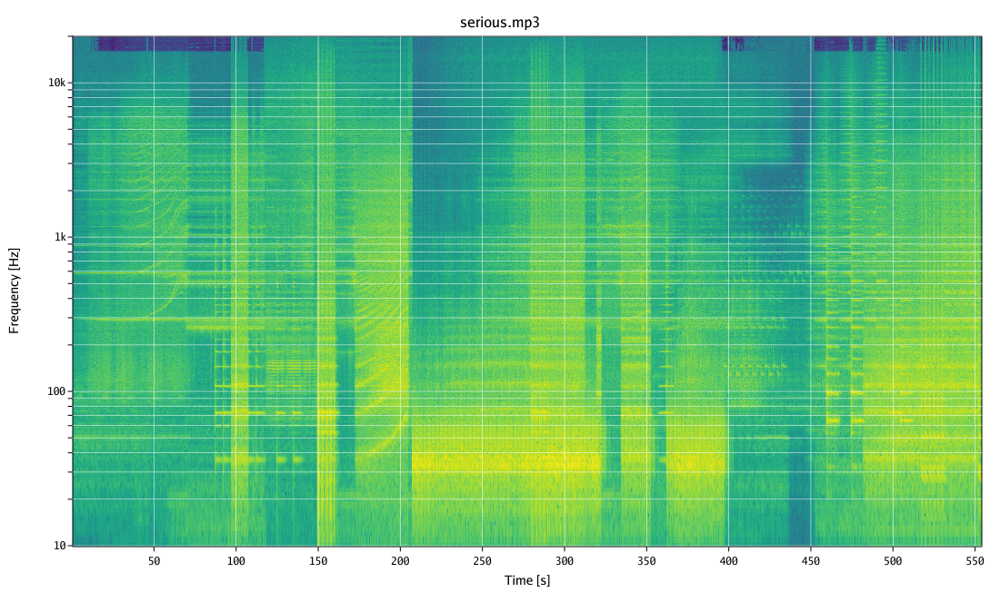

# soundspec

This is a rewrite in Go of [my old soundspec project](https://github.com/FlorinAndrei/soundspec). The app reads audio files, and generates their spectrograms: image files containing the evolution in time of the frequency spectrum of the sound.

For example, consider the song ['Why So Serious?'](https://www.youtube.com/watch?v=1zyhQjJ5UgY) by Hans Zimmer and James Newton Howard, from the movie 'The Dark Knight'. If you run this app on the audio file, this is the spectrogram you get (brighter tones indicate higher amplitudes):



The song has some impressive bass sequences in the middle, but the frequency is not that low, it's just 30 ... 40 Hz, and a good subwoofer should have no problems dealing with that.

This is why this app exists: as an objective check to your subjective impressions. How deep is that bass, really? Well, now you know.

# Installation

Make sure you have ffmpeg installed: https://www.ffmpeg.org/

Open a terminal or the Command Prompt, and try these commands: `ffmpeg` and `ffprobe`. If both commands show their usage message, you're good.

Click the Releases link to the right on this page. Pick the version of the app for your OS (macOS, Linux, Windows) and your CPU (AMD64, ARM64), and download it. Rename it as `soundspec` (or `soundspec.exe` on Windows) and put it anywhere in your PATH.

On macOS and Linux, make it executable: `chmod +x soundspec`

On macOS, if you get a pop-up when you try to run it, see this page: https://support.apple.com/en-us/102445#openanyway

If you type `soundspec` in the terminal and it shows the usage message, you're good.

# Usage

Run `soundspec -h` to get the help text.

Any audio file format recognized by `ffmpeg` will work, and that's *a lot* of formats.

## Single File Mode

This is triggered if the argument for `-i` is a single file.

```
soundspec -i file.mp3
```

The app will generate a file called `file.mp3.png` in the current directory. If you need that file created elsewhere, use the `-o` option.

## Recursive Mode

This is triggered if the argument for `-i` is a folder.

```
soundspec -i /path/to/music/folder
```

The app will descend through that folder and test every file in there with `ffprobe`. If the file is recognized as audio, a PNG spectrogram will be created from it.

The app will create, in the current folder, a structure of subfolders identical to that found in `/path/to/music/folder`, and will place PNG files in it. If you need that hierarchy created elsewhere, use the `-o` option.

The app will spawn one worker for each CPU core you have. If that's too many workers and the system gets bogged down, use the `-w` option to reduce their number.

Particular case - the music folder is in the current folder:

```
soundspec -i music_folder
```

In this case, the input and output folders are the same, and so each PNG file will be created right next to its source audio file.

Files that are not recognized by `ffmpeg` will be skipped. Errors, if any, are logged, and the app will continue processing the next files.

# Algorithm

This is a straightforward application of the Fourier transform: https://en.wikipedia.org/wiki/Fourier_transform

The app picks a short chunk of the audio stream and performs the Fourier transform. The output is one column of pixels in the spectrogram. Then it moves the window slightly to the right, and performs the transform again: that's the next column of spectrogram pixels. It goes on and on, in small steps, until the whole audio stream is processed. The spectrogram is generated one column of pixels at a time.

If the audio stream has multiple channels (e.g. stereo) then it's first converted to mono, then it is processed.
